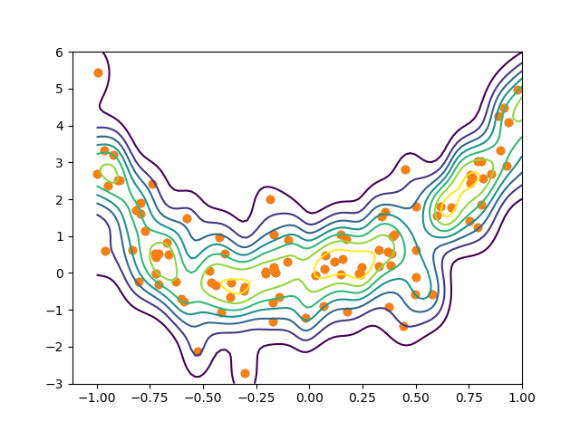
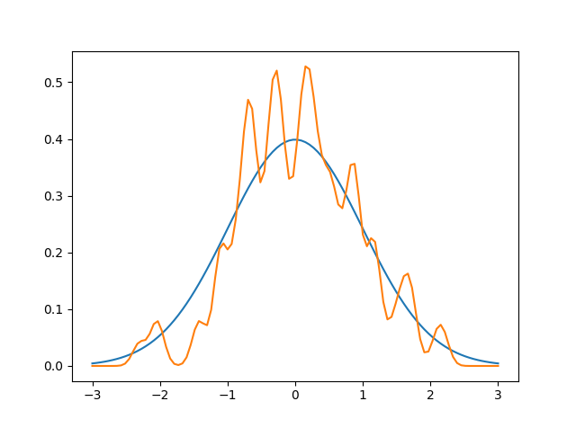
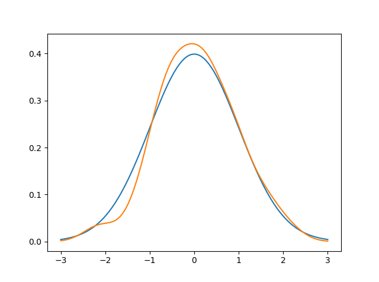

# Neighbour KDE with leave-one-out
Experimentation with KDEs and how it can be used in multivariate 
analysis as a very general distribution.

## Bivariate with distance measure
See "simple univariate" below for an intro. Ideas from kNN or local regression 
can be used to parametrise the KDE.

The KDE the in the following graph is using neighbouring points to form a
weighted KDE that is able to predict the distribution of the target when 
the explanatory variable changes.

The parameters std dev and distance function are estimated using leave-one-out
crossvalidation.

## Simple univariate
Univariate kde, optimization of leave-one-out cross-validation 
likelihood w.r.t. std dev of KDE in order to fit data.

Initalization, 100 samples:

Optimized leave-one-out likelihood:

